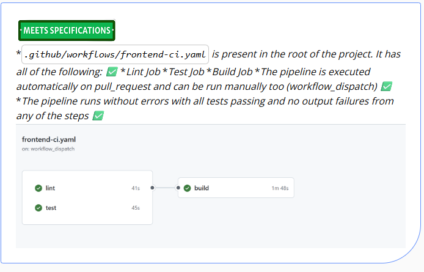
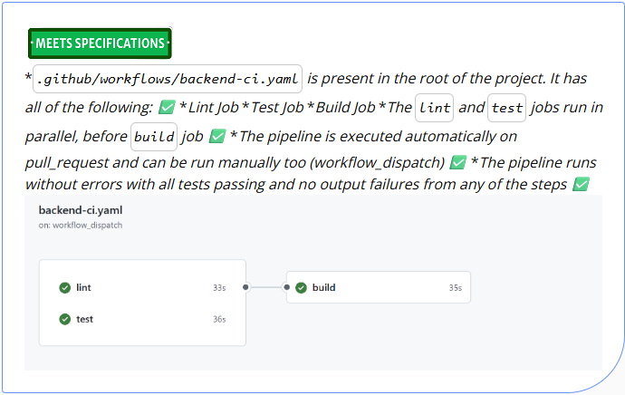
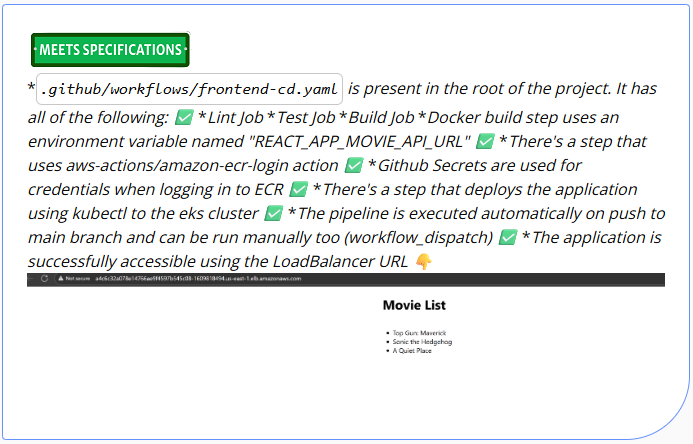
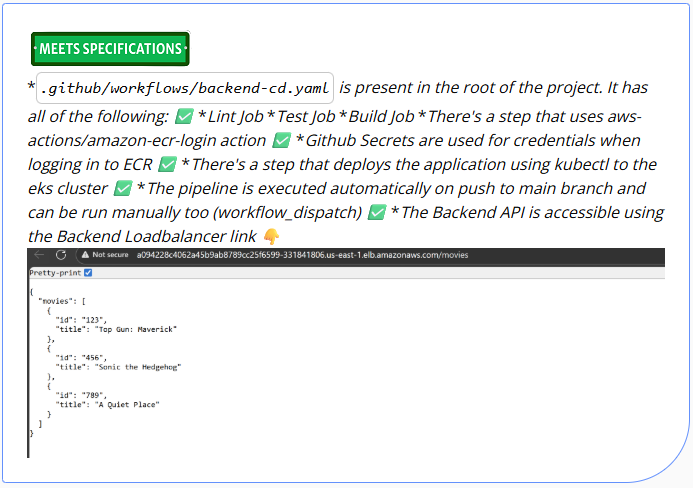

# Movie Picture Pipeline

## Working Application URLs

**Frontend Application:**
http://a4c6c32a078e14766ae9f4597b545c08-1609818494.us-east-1.elb.amazonaws.com

**Backend API:**
http://a094228c4062a45b9ab8789cc25f6599-331841806.us-east-1.elb.amazonaws.com/movies

You've been brought on as the DevOps resource for a development team that manages a web application that is a catalog of Movie Picture movies. They're in dire need of automating their development workflows in hopes of accelerating their release cycle. They'd like to use Github Actions to automate testing, building and deploying their applications to an existing Kubernetes cluster.

The team's project is comprised of 2 applications.

1. A frontend UI written in Typescript, using the React framework
2. A backend API written in Python using the Flask framework.

You'll find 2 folders, one named `frontend` and one named `backend`, where each application's source code is maintained. Your job is to use the team's [existing documentation](#frontend-development-notes) and create CI/CD pipelines to meet the teams' needs.

## Deliverables

### Frontend

1. A Continuous Integration workflow that:
   1. Runs on `pull_requests` against the `main` branch,only when code in the frontend application changes.
   2. Is able to be run on-demand (i.e. manually without needing to push code)
   3. Runs the following jobs in parallel:
      1. Runs a linting job that fails if the code doesn't adhere to eslint rules
      2. Runs a test job that fails if the test suite doesn't pass
   4. Runs a build job only if the lint and test jobs pass and successfully builds the application
2. A Continuous Deployment workflow that:
   1. Runs on `push` against the `main` branch, only when code in the frontend application changes.
   2. Is able to be run on-demand (i.e. manually without needing to push code)
   3. Runs the same lint/test jobs as the Continuous Integration workflow
   4. Runs a build job only when the lint and test jobs pass
      1. The built docker image should be tagged with the git sha
   5. Runs a deploy job that applies the Kubernetes manifests to the provided cluster.
      1. The manifest should deploy the newly created tagged image
      2. The tag applied to the image should be the git SHA of the commit that triggered the build

### Backend

1. A Continuous Integration workflow that:
   1. Runs on `pull_requests` against the `main` branch,only when code in the frontend application changes.
   2. Is able to be run on-demand (i.e. manually without needing to push code)
   3. Runs the following jobs in parallel:
      1. Runs a linting job that fails if the code doesn't adhere to eslint rules
      2. Runs a test job that fails if the test suite doesn't pass
   4. Runs a build job only if the lint and test jobs pass and successfully builds the application
2. A Continuous Deployment workflow that:
   1. Runs on `push` against the `main` branch, only when code in the frontend application changes.
   2. Is able to be run on-demand (i.e. manually without needing to push code)
   3. Runs the same lint/test jobs as the Continuous Integration workflow
   4. Runs a build job only when the lint and test jobs pass
      1. The built docker image should be tagged with the git sha
   5. Runs a deploy job that applies the Kubernetes manifests to the provided cluster.
      1. The manifest should deploy the newly created tagged image
      2. The tag applied to the image should be the git SHA of the commit that triggered the build


**⚠️ NOTE**
Once you begin work on Continuous Deployment, you'll need to first setup the AWS and Kubernetes environment. Follow [these instructions ](#setting-up-continuous-deployment-environment) only when you're ready to start testing your deployments.

## One-time setup instructions

The project assumes you'll be working in the Udacity workspace where all the necessary system dependencies are installed and setup, ready for use.
The following steps are required to be run only once to initialize and create your repository with all the files that you'll use for the project.
### Login
Launch the Udacity workspace and open the terminal in VSCode to start executing the following commands:
1. Start the login process with `gh`
```bash
gh auth login
```
   2. Select `Github.com`
   3. Select `HTTPS`
   4. Enter `Y` or just press **Enter** to authenticate with Github credentials
   5. Select **Login with a web browser**
   6. Highlight and copy the one-time code then press **Enter** to open the browser
   7. If VSCode pops-up with a warning, click **Open**
   8. Enter your Github credentials at the login page
      1. You may need to perform your 2FA step next
   9. Paste in the one-time code that was given on the CLI prompt and click **Continue**
      1. If you're prompted for authorizing access to any organizations, you don't have to do that. The `gh` cli for this course just needs to be able to create repos in your personal account.
   10. Click authorize to allow the Github CLI to access your repository information.
   11. You can close the Github window and go back to the Udacity workspace tab

### Configuration
Next you'll need to configure git to use your desired email.

If you already know what email you'd like to use, great! If you'd like to use the `noreply` email address that Github offers, follow [these instructions](https://docs.github.com/en/account-and-profile/setting-up-and-managing-your-personal-account-on-github/managing-email-preferences/setting-your-commit-email-address#setting-your-commit-email-address-on-github)

**Configure git with your email address**
```bash
git config --global user.email "YOUR_EMAIL"
```
   
Now we'll finish up by initializing the repository and using the `gh` command to push the files to a new repository under you Github account. The last command uses `udacity-build-cicd-project` as the repository name, but you can change this to be whatever you'd like that doesn't conflict with an existing repo name in your account.

**Initialize the workspace as a git repository**
```bash
git init
```
   
**Stage the workspace files for committing**
```bash
git add .
```
   
**Commit the workspace files**
```bash
git commit -m "initial"
```
   
**Create your public repository and push the initial changes (it needs to be public to allow Github Actions to run for free)**
```bash
gh repo create udacity-build-cicd-project --source=. --public --push
```

As you work on the project, you won't need to create or initialize the repo again. You'll just need to make changes to your workflows in the `.github/workflows` folder, and perform `git add .` `git commit` and `git push` commands to make the files available in your repository and view your actions in the Github Actions interface.


## Setting up Continuous Deployment environment

Only complete these steps once you've finished your Continuous Integration pipelines for the frontend and backend applications. This section is meant to create a Kubernetes environment for you to deploy the applications to and verify the deployment step.

First we need to prep the AWS account with the necessary infrastructure for deploying the frontend and backend applications. As the focus of this course is building the CI/CD pipelines, we won't be requiring you to setup all of the underlying AWS and Kubernetes infrastructure. This will be done for you with the provided Terraform and helper scripts. As there are costs associated with running this infrastucture, **REMEMBER** to destroy everything before stopping work. Everything can be recreated, and the pipeline work you'll be doing is all saved in this repository.

### Create AWS infrastructure with Terraform

1. Export your AWS credentials from the Cloud Gateway
2. Use the commands below to run the Terraform and type `yes` after reviewing the expected changes

```bash
cd setup/terraform
terraform apply
```

4. Take note of the Terraform outputs. You'll need these later as you work on the project. You can always retrieve these values later with this command

```bash
cd setup/terraform
terraform output
```

### Generate AWS access keys for Github Actions

1. Once everything is created, you'll need to generate AWS credentials for the IAM user account that Github Actions will use in order to interact with your AWS account.
2. Launch the Cloud Gateway and go to the IAM service.
3. Under users, you should only see the `github-action-user` user account
4. Click the account and go to `Security Credentials`
5. Under `Access keys`  select `Create access key`
6. Select `Application running outside AWS` and click `Next`, then `Create access key` to finish creating the keys
7. On the last page, make sure to copy/paste these keys for storing in Github Secrets


### Add Github Action user to Kubernetes

Now that the cluster and all AWS resources have been created, you'll need to add the `github-action-user` IAM user ARN to the Kubernetes configuration that will allow that user to execute `kubectl` commands against the cluster.

1. Run the `init.sh` helper script in the `setup` folder

```bash
cd setup
./init.sh
```

2. The script will download a tool, add the IAM user ARN to the authentication configuration, indicate a `Done` status, then it'll remove the tool

## Dependencies

We've provided the below list of dependencies to assist in the case you'd like to run any of the work locally. Local development issues, however, are not supported as we cannot control the environment as we can in the online workspace.

All of the tools below will be available in the workspace

* [docker](https://docs.docker.com/desktop/install/debian/) - Used to build the frontend and backend applications
* [kubectl](https://kubernetes.io/docs/tasks/tools/) - Used to apply the kubernetes manifests
* [pipenv](https://pipenv.pypa.io/en/latest/install/#pragmatic-installation-of-pipenv) - Used for mananging Python version and dependencies
* [nvm](https://github.com/nvm-sh/nvm#installing-and-updating) - Used for managing NodeJS versions
* [tfswitch](https://tfswitch.warrensbox.com/Install/) Used for managing Terraform versions
* [kustomize](https://kubectl.docs.kubernetes.io/installation/kustomize/) Used for building the Kubernetes manifests dynamically in the CI environment
* [jq](https://stedolan.github.io/jq/download/) for parsing JSON more easily on the command line

## Frontend Development notes

### Running tests

While in the frontend directory, perform the following steps:

```bash
# Use correct NodeJS version
nvm use

# Install dependencies
npm ci

# Run the tests interactively. You'll need to press `a` to run the tests
npm test

# OR simulate running the tests in a CI environment
CI=true npm test


# Expected output
PASS src/components/__tests__/MovieList.test.js
PASS src/components/__tests__/App.test.js

Test Suites: 2 passed, 2 total
Tests:       3 passed, 3 total
Snapshots:   0 total
Time:        1.33 s
Ran all test suites.
```

To simulate a failure in the test coverage, which will be needed to ensure your CI/CD pipeline fails on bad tests, set the MOVIE_HEADING variable before the command like so:

```bash
FAIL_TEST=true CI=true npm test
```

As the test is expecting the heading to contain a certain value, we can simulate a failure by changing it with an inline or environment variable. If you use the environment variable, make sure to unset it when you're done testing

```bash
# Expect tests to fail with this set to anything except Movie List
export FAIL_TEST=true
CI=true npm test

# Expect tests to be passing again
unset MOVIE_HEADING
CI=true npm test
```

```bash
# Expected failure output
FAIL src/components/__tests__/App.test.js
  ● renders Movie List heading

    TestingLibraryElementError: Unable to find an element with the text: messed_up. This could be because the text is broken up by multiple elements. In this case, you can provide a function for your text matcher to make your matcher more flexible.

    Ignored nodes: comments, script, style
    <body>
      <div>
        <div>
          <h1>
            Movie List
          </h1>
          <ul />
        </div>
      </div>
    </body>

       8 | test('renders Movie List heading', () => {
       9 |   render(<App />);
    > 10 |   const linkElement = screen.getByText(movieHeading);
         |                              ^
      11 |   expect(linkElement).toBeInTheDocument();
      12 | });
      13 |

      at Object.getElementError (node_modules/@testing-library/react/node_modules/@testing-library/dom/dist/config.js:37:19)
      at allQuery (node_modules/@testing-library/react/node_modules/@testing-library/dom/dist/query-helpers.js:76:38)
      at query (node_modules/@testing-library/react/node_modules/@testing-library/dom/dist/query-helpers.js:52:17)
      at getByText (node_modules/@testing-library/react/node_modules/@testing-library/dom/dist/query-helpers.js:95:19)
      at Object.<anonymous> (src/components/__tests__/App.test.js:10:30)

PASS src/components/__tests__/MovieList.test.js
```

### Running linter

When there are no linting errors, the output won't return any errors

```bash
npm run lint

# Expected output
> frontend@1.0.0 lint
> eslint .
```

To simulate linting errors, you can run the linting command like so:

```bash
FAIL_LINT=true npm run lint

# Expected output
> frontend@1.0.0 lint
> eslint .


/home/kirby/udacity/ci-cd/project/solution/frontend/src/components/MovieDetails.js
  4:24  error  'movie' is missing in props validation     react/prop-types
  7:70  error  'movie.id' is missing in props validation  react/prop-types

✖ 2 problems (2 errors, 0 warnings)
```

### Build and run

For local development without docker, the developers use the following commands:

```bash
cd starter/frontend

# Install dependencies
npm ci

# Run local development server with hot reloading and point to the backend default
REACT_APP_MOVIE_API_URL=http://localhost:5000 npm start
```

To build the frontend application for a production deployment, they use the following commands:

```bash
# Build the image
# NOTE: Make sure the image is built with the URL of the backend system.
# The URL below would be the default backend URL when running locally
docker build --build-arg=REACT_APP_MOVIE_API_URL=http://localhost:5000 --tag=mp-frontend:latest .

docker run --name mp-frontend -p 3000:3000 -d mp-frontend]

# Open the browser to localhost:3000 and you should see the list of movies,
# provided the backend is already running and available on localhost:5000
```

### Deploy Kubernetes manifests

In order to build the Kubernetes manifests correctly, the team uses `kustomize` in the following way:

```bash
cd starter/frontend/k8s
# Make sure you're kubeconfig is configured for the EKS cluster, i.e.
# aws eks update-kubeconfig

# Set the image tag to the newer version
# ℹ️ Don't commit any changes to the manifests that this command introduces
kustomize edit set image frontend=<ECR_REPO_URL>:<NEW_TAG_HERE>

# Apply the manifests to the cluster
kustomize build | kubectl apply -f -
```

## Backend Development notes

### Running tests

While in the backend directory, perform the following steps:

```bash
# Install dependencies
pipenv install

# Run the tests
pipenv run test

# Expected output
================================================================== test session starts ==================================================================
platform linux -- Python 3.10.6, pytest-7.2.1, pluggy-1.0.0 -- /home/kirby/.local/share/virtualenvs/backend-AXGg_iGk/bin/python
cachedir: .pytest_cache
rootdir: /home/kirby/udacity/cd12354-build-ci-cd-pipelines-monitoring-and-logging/project/solution/backend
collected 3 items

test_app.py::test_movies_endpoint_returns_200 PASSED                                                                                              [ 33%]
test_app.py::test_movies_endpoint_returns_json PASSED                                                                                             [ 66%]
test_app.py::test_movies_endpoint_returns_valid_data PASSED                                                                                       [100%]
```

To simulate failing the backend tests, run the following command:

```bash
FAIL_TEST=true pipenv run test

# Expected output
==================================================================== test session starts ====================================================================
platform linux -- Python 3.10.6, pytest-7.2.1, pluggy-1.0.0 -- /home/kirby/.local/share/virtualenvs/backend-AXGg_iGk/bin/python
cachedir: .pytest_cache
rootdir: /home/kirby/udacity/ci-cd/project/solution/backend
collected 3 items

test_app.py::test_movies_endpoint_returns_200 FAILED                                                                                                  [ 33%]
test_app.py::test_movies_endpoint_returns_json PASSED                                                                                                 [ 66%]
test_app.py::test_movies_endpoint_returns_valid_data PASSED                                                                                           [100%]

========================================================================= FAILURES ==========================================================================
_____________________________________________________________ test_movies_endpoint_returns_200 ______________________________________________________________

    def test_movies_endpoint_returns_200():
        with app.test_client() as client:
            status_code = os.getenv("FAIL_TEST", 200)
            response = client.get("/movies/")
>           assert response.status_code == status_code
E           AssertionError: assert 200 == 'true'
E            +  where 200 = <WrapperTestResponse streamed [200 OK]>.status_code

test_app.py:9: AssertionError
================================================================== short test summary info ==================================================================
FAILED test_app.py::test_movies_endpoint_returns_200 - AssertionError: assert 200 == 'true'
================================================================ 1 failed, 2 passed in 0.11s ================================================================
```

### Running linter

When there are no linting errors, there won't be any output.

```bash
pipenv run lint
# No output
```

To simulate linting errors, you can run the linting command below. The command overrides our lint configuration and will error if any lines are over 88 characters.

```bash
pipenv run lint-fail

# Expected output
./movies/__init__.py:7:89: E501 line too long (120 > 88 characters)
./movies/__init__.py:9:89: E501 line too long (101 > 88 characters)
./movies/movies_api.py:7:89: E501 line too long (120 > 88 characters)
./movies/movies_api.py:9:89: E501 line too long (101 > 88 characters)
./movies/resources.py:16:89: E501 line too long (117 > 88 characters)
```

### Build and run

For local development without docker, the developers use the following commands to build and run the backend application:

```bash
cd starter/backend

# Install dependencies
pipenv install

# Run application
pipenv run serve
```

For production deployments, the team uses the following commands to build and run the Docker image.

```bash
cd starter/backend

# Build the image
docker build --tag mp-backend:latest .

# Run the image
docker run -p 5000:5000 --name mp-backend -d mp-backend

# Check the running application
curl http://localhost:5000/movies

# Review logs
docker logs -f mp-backend

# Expected output
{"movies":[{"id":"123","title":"Top Gun: Maverick"},{"id":"456","title":"Sonic the Hedgehog"},{"id":"789","title":"A Quiet Place"}]}

# Stop the application
docker stop
```

### Deploy Kubernetes manifests

In order to build the Kubernetes manifests correctly, the team uses `kustomize` in the following way:

```bash
cd starter/backend/k8s
# Make sure you're kubeconfig is configured for the EKS cluster, i.e.
# aws eks update-kubeconfig

# Set the image tag to the newer version
# ℹ️ Don't commit any changes to the manifests that this command introduces
kustomize edit set image backend=<ECR_REPO_URL>:<NEW_TAG_HERE>

# Apply the manifests to the cluster
kustomize build | kubectl apply -f -
```

## License

[License](LICENSE.md)

---

# Project: Movie Picture Pipeline
*Submission Date: September 8, 2025*

# Feedback Details
## Specification Review
### Reviewer Note
#### Congratulations !
You did an excellent work considering it was your first attempt at this project. You project really shows the dedication you've put into this. All the four aspects of this project were wonderfully covered in your submission:

Continuous Integration (Frontend/Backend) ✅
Continuous Deployment (Frontend/Backend) ✅
You completed one of the important milestones in your journey as Cloud DevOps student. All the hard work did pay off and you have passed with flying colors. 🌈

This project introduced to you the concept of CI/CD - which is one of the critical concepts when it comes to DevOps.
I really enjoyed reviewing your submission and hope this project gave some good practical learning. Take a small break and prepare for the next battle.

NOTE: As you've passed the project now, please make sure to delete all the AWS resources created for this project to avoid recurring bills
Additional Resources 💡:
To further enhance your knowledge and skills, here are some helpful resources:

- : You can bookmark this link which constantly shares new blogs related to DevOps. Reading these blogs can help you keep updated about the recent trends and can also give you ideas about your future projects
- : This blog regularly features articles, case studies, and tutorials covering GitHub Actions, DevOps practices, and cloud integration, providing valuable insights and best practices for working on these topics.
Keep up the fantastic work, and never stop learning and growing. Your determination and passion for excellence will undoubtedly lead you to even greater successes in the future.

PS: If you have any doubts regarding any of the concept, feel free to search or post a question on  where many of the fellow students and mentors may have faced the same situation before and would have provided the appropriate steps to resolve it.

Have a great rest of your day and stay safe ✌

We do love to hear our student feedbacks ⭐⭐⭐ on project reviews to continue providing you with the best learning experience. We would appreciate if you could take few seconds of your precious time to provide the feedback related to this project review (not course feedback)

#### Build CI Pipeline for Frontend
Build a Continuous Integration pipeline for the frontend end application using Github Actions. The pipeline should be configured to meet the team's needs, fulfilling the requirements of linting, testing, and building of the application on every pull request against the main branch.

Ensure the workflow is named Frontend Continuous Integration and the file should be called frontend-ci.yaml.

Reviewer Note



Meets specification - For criteria.png*.github/workflows/frontend-ci.yaml is present in the root of the project. It has all of the following: ✅ *Lint Job *Test Job *Build Job *The pipeline is executed automatically on pull_request and can be run manually too (workflow_dispatch) ✅ *The pipeline runs without errors with all tests passing and no output failures from any of the steps ✅Flameshot-2025-09-08_13-28.png

There should be a file called .github/workflows/frontend-ci.yaml in the root of the project.

The following jobs should be present

LINT JOB: There should be a job in the workflow that runs linting. The job should have these steps:

Checkout code
Setup NodeJS
Perform a cache action to restore cache before dependency install
Install dependencies
Run the npm run lint command
TEST JOB: There should be a job in the workflow that runs the tests The job should have these steps:

Checkout code
Setup NodeJS
Perform a cache action to restore cache before dependency install
Install dependencies
Run the npm run test command
The two jobs above should run in parallel

BUILD JOB: This job should only run after the first 2 succeed (student has to use the "needs" syntax) There should be a step that builds the application using docker. The job should have these steps:

Checkout code
Setup NodeJS
Perform a cache action to restore cache before dependency install
Install dependencies
Run the npm run test command
The pipeline should be executed automatically on pull_request The pipeline should be able to be run manually The pipeline should be running without errors with all tests passing and no output failures from any of the steps

#### Build CI Pipeline for Backend

Build a Continuous Integration pipeline for the backend application using Github Actions. The pipeline should be configured to meet the team's needs, fulfilling the requirements of linting, testing, and building of the application on every pull request against the main branch.

Ensure the workflow is named "Backend Continuous Integration" and the file should be called "backend-ci.yaml"

Reviewer Note



Meets specification - For criteria.png*.github/workflows/backend-ci.yaml is present in the root of the project. It has all of the following: ✅ *Lint Job *Test Job *Build Job *The lint and test jobs run in parallel, before build job ✅ *The pipeline is executed automatically on pull_request and can be run manually too (workflow_dispatch) ✅ *The pipeline runs without errors with all tests passing and no output failures from any of the steps ✅Flameshot-2025-09-08_13-29.png

There should be a file called .github/workflows/backend-ci.yaml in the root of the project There should be a job in the workflow that runs linting. There should be a job in the workflow that runs the tests Linting and testing should be done in parallel.

The job and lint should complete before proceeding to the build step There should be a job that builds the application using docker.

The pipeline should be executed automatically on pull_request The pipeline should also be able to be run manually The pipeline should be running without errors with all tests passing and no output failures from any of the steps

#### Build CD Pipeline for Frontend

Build a Continuous Deployment pipeline for the frontend application using Github Actions. The pipeline should be configured to meet the team's needs, fulfilling the requirements of linting, testing, building and deploying of the application on every merge to the main branch.

Ensure the workflow is named "Frontend Continuous Deployment" and the file should be called "frontend-cd.yaml"

Reviewer Note



Meets specification - For criteria.png*.github/workflows/frontend-cd.yaml is present in the root of the project. It has all of the following: ✅ *Lint Job *Test Job *Build Job *Docker build step uses an environment variable named "REACT_APP_MOVIE_API_URL" ✅ *There's a step that uses aws-actions/amazon-ecr-login action ✅ *Github Secrets are used for credentials when logging in to ECR ✅ *There's a step that deploys the application using kubectl to the eks cluster ✅ *The pipeline is executed automatically on push to main branch and can be run manually too (workflow_dispatch) ✅ *The application is successfully accessible using the LoadBalancer URL 👇Flameshot-2025-09-08_13-29_1.png

There should be a file called .github/workflows/frontend-cd.yaml in the root of the project

There should be a step in the workflow that runs linting and passes

There should be a step in the workflow that runs the tests and passes

There should be a step that builds the application using docker only after linting and testing complete (use the needs directive) This step should also utilize build-args to ensure the application is built with an environment variable REACT_APP_MOVIE_API_URL

There should be a step that utilizes aws-actions/amazon-ecr-login action for logging into ECR. (using 3rd party actions) The ECR login step should also be accessing Github Secrets for credentials. (secure approach)

There should be a step that pushes the docker image to ECR in the AWS account. There should be a step that deploys the application using kubectl to the eks cluster

The pipeline should be executed automatically on merges to the main branch The pipeline should be able to be run manually for verification purposes The pipeline should be running without errors, with all tests passing and no output failures from any of the steps

If there are AWS credentials anywhere in any of the pipelines = FAIL
If any of the pipelines are failing to run or have failed steps = FAIL
If any of the pipelines pass when there's a test failure = FAIL (will provide steps on how to simulate test failure)
If the docker image doesn't get uploaded to ECR = FAIL
If the application isn't successfully running on the cluster = FAIL (the frontend should be able to pull the list of movies and verify the environment variable was passed correctly)
Submit a working URL or screenshots showing the frontend application is functioning.

#### Build CD Pipeline for Backend

Build a Continuous Deployment pipeline for the backend application using Github Actions. The pipeline should be configured to meet the team's needs, fulfilling the requirements of linting, testing, building and deploying of the application on every merge to the main branch.

Ensure the workflow is named "Backend Continuous Deployment" and the file should be called "backend-cd.yaml"

Reviewer Note



Meets specification - For criteria.png*.github/workflows/backend-cd.yaml is present in the root of the project. It has all of the following: ✅ *Lint Job *Test Job *Build Job *There's a step that uses aws-actions/amazon-ecr-login action ✅ *Github Secrets are used for credentials when logging in to ECR ✅ *There's a step that deploys the application using kubectl to the eks cluster ✅ *The pipeline is executed automatically on push to main branch and can be run manually too (workflow_dispatch) ✅ *The Backend API is accessible using the Backend Loadbalancer link 👇Flameshot-2025-09-08_13-29_2.png

There should be a file called .github/workflows/frontend-cd.yaml in the root of the project There should be a step in the workflow that runs linting. There should be a step in the workflow that runs the tests There should be a step that builds the application using docker.

There should be a step that utilizes aws-actions/amazon-ecr-login action for logging into ECR. (using 3rd party actions) The ECR login step should also be accessing Github Secrets for credentials. (secure approach)

There should be a step that pushes the docker image to ECR in the AWS account. There should be a step that deploys the application using kubectl to the Kubernetes cluster

The pipeline should be executed automatically on merges to the main branch The pipeline should be able to be run manually for verification purposes The pipeline should be running without errors, with all tests passing and no output failures from any of the steps

If there are AWS credentials anywhere in any of the pipelines = FAIL
If any of the pipelines are failing to run or have failed steps = FAIL
If any of the pipelines pass when there's a test failure = FAIL (will provide steps on how to simulate test failure)
If the docker image doesn't get uploaded to ECR = FAIL
If the application isn't successfully running on the cluster = FAIL
Submit a working URL or screenshot showing that the Backend API returns the list of movies.
